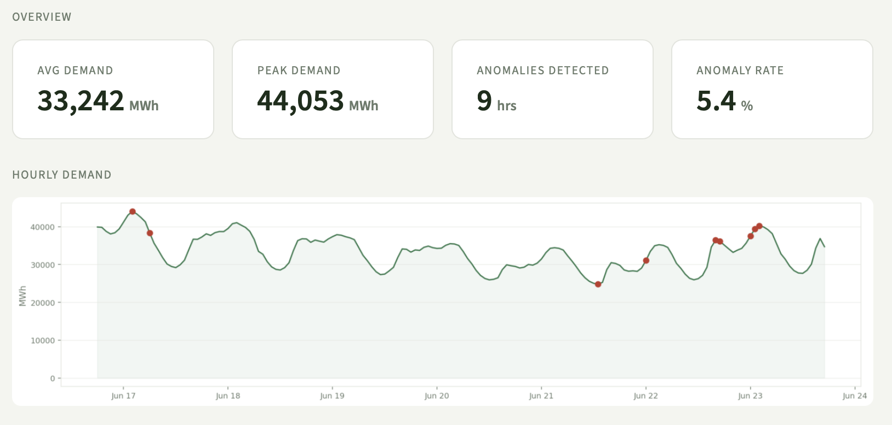
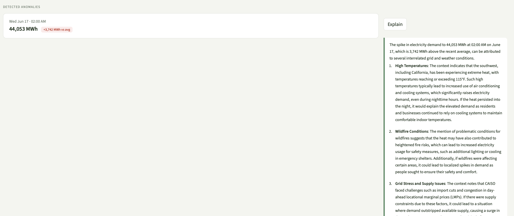

# California Grid Anomaly Detector

A project I built to learn about RAG and energy systems. It pulls live electricity demand data from California's grid, flags unusual hours using machine learning, and uses an LLM to explain what might have caused each anomaly.


---

## What it does

1. Pulls hourly California electricity demand from the EIA API (free, public data)
2. Runs Isolation Forest to detect hours where demand seems unusual.
3. For each anomaly, retrieves relevant chunks from CAISO reports, EIA forecasts, and energy news
4. Sends those chunks to GPT-4o-mini to generate an explanation
5. Shows everything on a Streamlit dashboard
---
## Screenshots


*Metric cards, demand chart with anomaly flags*


*AI-generated explanation for the Jun 17 2am demand spike*

## Stack

- **Energy Demand Data:** EIA Open Data API
- **Anomaly detection:** scikit-learn IsolationForest
- **Embeddings:** OpenAI text-embedding-3-small
- **Vector store:** Chroma (local)
- **LLM:** GPT-4o-mini 
- **UI:** Streamlit

---

## How to run it

```bash
# Install dependencies
pip install requests pandas matplotlib scikit-learn langchain langchain-openai \
            langchain-community chromadb beautifulsoup4 streamlit openai tiktoken

# Set your OpenAI API key
export OPENAI_API_KEY= your_key_here

# Pull EIA data
python pipeline.py

# Ingest documents into vector store
python ingest.py

# Run the app
streamlit run app.py
```

---

## File structure

```
├── app.py              # Streamlit dashboard
├── pipeline.py         # EIA data pull + anomaly detection
├── ingest.py           # Document scraping + vector store
├── agent.py            # RAG chain + explanations
├── eval.py             # Evaluation set
├── debug_retrieval.py  # Retrieval debugging
└── check_db.py         # Check vector store contents
```

